#打包与运行环境配置
&emsp;&emsp;完成以下操作，才能在编辑器中使用打包功能：

&emsp;&emsp;1、	环境搭建（Win/Mac）

&emsp;&emsp;2、	在编辑器中配置发布和打包设置

###环境搭建&打包设置

&emsp;&emsp;一、Windows平台

&emsp;&emsp;注意：JDK、NDK、SDK、Framework的安装路径、电脑的系统变量配置、以及编辑器打包设置中这些工具的路径配置一定要都正确，任何一个地方不对，打包很有可能会出现错误。

&emsp;&emsp;1、从商店下载JDK，安装到英文目录，非英文尤其中文目录可能会导致打包出现异常问题。
安装成功后，Java目录下会生成2个文件夹，分别以jdk和jre开头。需要将这2个文件夹下的bin路径配置到系统变量里面。

&emsp;&emsp;添加系统变量JAVA_HOME，变量值是jdk文件夹路径。如下截图：

&emsp;&emsp;
 
&emsp;&emsp;编辑系统变量Path，在后面追加jre文件夹下的bin路径，注意，需要先输入一个半角分号，再输入bin路径，例如： C:\Program Files\Java\jre1.8.0_45\bin，如下截图：

&emsp;&emsp;

&emsp;&emsp;2、从商店下载NDK，双击android-ndk-r10d-windows-x86_64.exe，将其安装到英文目录，非英文尤其中文目录可能会导致打包出现异常问题。

&emsp;&emsp;安装目录下的文件截图：

&emsp;&emsp;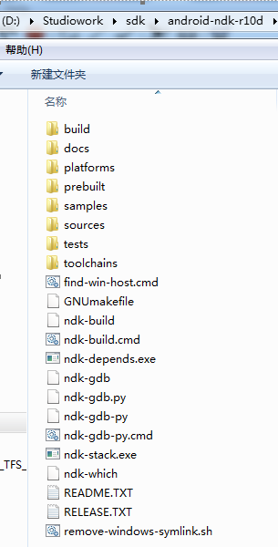

&emsp;&emsp;编辑系统变量Path，在Path值后面添加android-ndk-r10d、build和platforms的路径，以半角分号隔开，例如：
；D:\Studiowork\sdk\android-ndk-r10d\build\tools；D:\Studiowork\sdk\android-ndk-r10d；D:\Studiowork\sdk\android-ndk-r10d\platforms

&emsp;&emsp;3、从商店下载SDK，解压到英文目录，非英文尤其中文目录可能会导致打包出现异常问题。

&emsp;&emsp;编辑系统变量Path，在Path值后面添加platforms、platform-tools和tools的路径，以半角分号隔开，例如：
；D:\Studiowork\sdk\sdk\platforms；D:\Studiowork\sdk\sdk\platform-tools；D:\Studiowork\sdk\sdk\tools

&emsp;&emsp;4、从商店下载匹配的Framework版本，安装到英文目录，非英文尤其中文目录可能会导致打包出现异常问题。

&emsp;&emsp;5、创建一个cocos项目，创建过程中一定要选择一个Framework版本。点击编辑器菜单栏->编辑->偏好设置->平台。

&emsp;&emsp;注意：以下路径设置一定要正确，不然打包会出错！

&emsp;&emsp;SDK路径：设置为SDK文件夹路径。（该路径下有platforms、platform-tools和tools等文件夹）

&emsp;&emsp;NDK路径：设置为NDK文件夹路径。（该路径下有build和platforms等文件夹）

&emsp;&emsp;ANT路径：设置为Framework安装目录下ant的bin文件夹路径。请注意，当电脑上安装了多个Framework版本，打包时选了哪个版本（菜单栏点击项目->项目设置->打包->Cocos Framework版本），ant路径最好也设置成这个Framework版本的bin文件夹路径。

&emsp;&emsp;JDK路径：设置为jdk的bin路径。

&emsp;&emsp;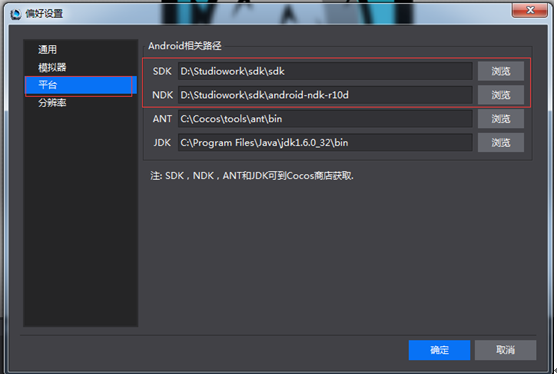
 
&emsp;&emsp;6、验证环境变量和打包配置是否成功

&emsp;&emsp;点击菜单栏->项目->执行打包，打包完成后，点击编辑器画布下方的输出面板，如果显示打包成功，说明环境已经配置成功。否则需要检查出错的地方，重新配置。

&emsp;&emsp;7、可能引发错误的原因： 

- 电脑上安装过对应工具，但版本过低。

&emsp;&emsp;解决办法：卸载出错的工具，清除残留的安装文件。去掉系统变量Path值中的该工具路径。从商店中下载该工具，按照文档开头的步骤安装、配置。

- 安装目录含有非英文。

&emsp;&emsp;解决办法：参见上一条。

- 系统变量配置错误。

&emsp;&emsp;解决办法：认真、仔细核对一遍所有系统变量。是否同一个工具配置了不同的路径，是否同一个系统变量值中各个工具的路径没有用半角分号隔开（非常土的办法，将变量值全选复制出来一一核对）

- Ant路径配置错误。

&emsp;&emsp;解决办法：检查电脑上是否安装了多个Framework版本？ant路径是否和打包时选择的Framework版本一致？ 

#####二、Mac平台

&emsp;&emsp;Mac平台工具安装相对Windows要简单，不需要配置环境变量。

&emsp;&emsp;1、Android打包的环境配置和Windows一样，不同的是Mac上面需要安装对应Mac版本的JDK、SDK、NDK。

&emsp;&emsp;2、iOS打包配置

&emsp;&emsp;重要提示：你需要有一个苹果开发者证书（*.p12）和配对的密钥（*.cer）

&emsp;&emsp;（1）配置苹果开发者证书，双击*.p12文件，打开如下图所示的界面，

&emsp;&emsp;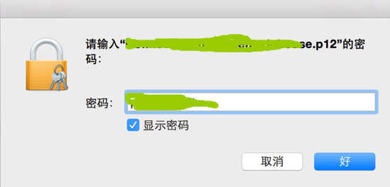

&emsp;&emsp;输入正确的密码，点击“好”，打开如下图所示的界面，

&emsp;&emsp;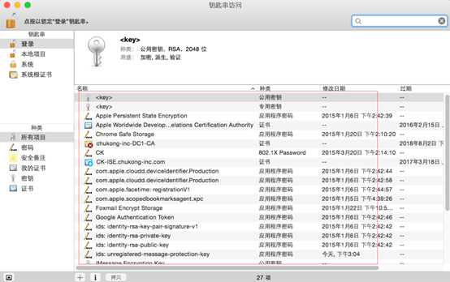

&emsp;&emsp;将*.cer拖动到此界面中。

&emsp;&emsp;（2）验证秘钥是否添加成功。
打开终端，运行此命令：security find-identity -v -p codesigning  出现以下截图说明添加成功了：

&emsp;&emsp;

###打包功能

&emsp;&emsp;环境搭建成功后，需要在编辑器中配置必要的发布和打包设置，再执行打包功能。

&emsp;&emsp;**一、Windows上打包测试：**

&emsp;&emsp;1、C++项目打包举例

&emsp;&emsp;比如：希望将一个C++项目发布成csb格式，打apk包。

&emsp;&emsp;步骤1：设置C++项目的发布格式，如下截图：
 
&emsp;&emsp;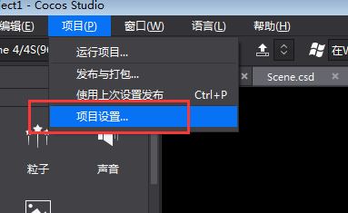

&emsp;&emsp;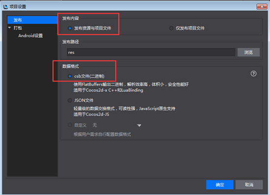 

&emsp;&emsp;步骤2：执行发布和打包，如下截图
 
&emsp;&emsp;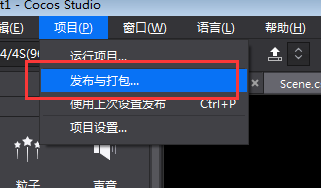 

&emsp;&emsp;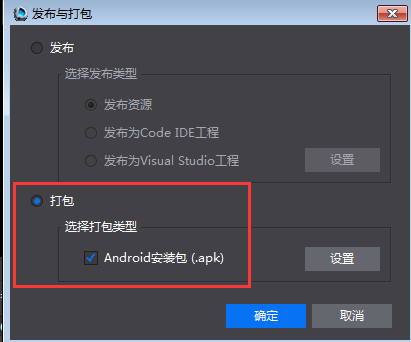  

&emsp;&emsp;Apk包存放地址：

&emsp;&emsp;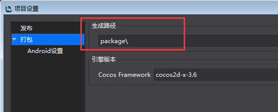  

&emsp;&emsp;这是个相对路径，在项目工程下。

&emsp;&emsp;2、Lua或JavaScript项目同理。

&emsp;&emsp;**二、Mac上打包测试：**

&emsp;&emsp;Android打包和Windows上面的一样。

&emsp;&emsp;iOS打包：

&emsp;&emsp;1、创建一个cocos项目（必须选择一个引擎版本）

&emsp;&emsp;2、导入项目资源

&emsp;&emsp;3、发布项目到Xcode，修改项目的名称和秘钥

&emsp;&emsp;点击左侧的项目，选中“General”，修改Bundle Identifier值为*.p12文件的文件名。本教程中使用Com.cocosstudio.demo.inhouse作为文件名。

&emsp;&emsp;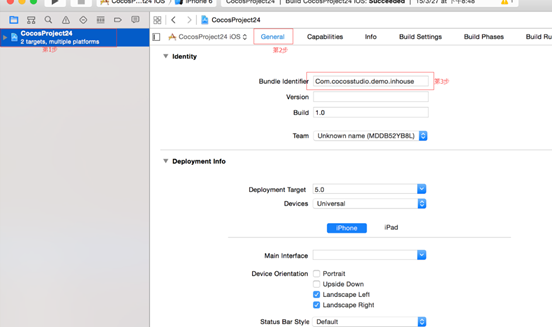 

选中“Build Settings”->Code Signing->Code Signing Identity，选择设置的密码。
“Build Settings”->Code Signing->Provisioning Profile，选择cocosstudioDemoInhouse
设置如下图所示：

&emsp;&emsp;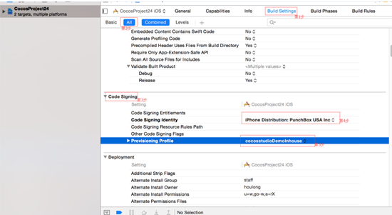 

&emsp;&emsp;4、Cocos编辑器中执行打包

&emsp;&emsp;菜单栏->项目->执行打包，选择iOS或Android。

&emsp;&emsp;5、打包成功之后安装到手机上查看效果。

###运行功能

&emsp;&emsp;运行功能的配置与打包功能的环境配置一样，不一样的地方在于运行支持Android手机连上PC或者Mac可以直接把游戏推送到手机上，直接预览效果。
