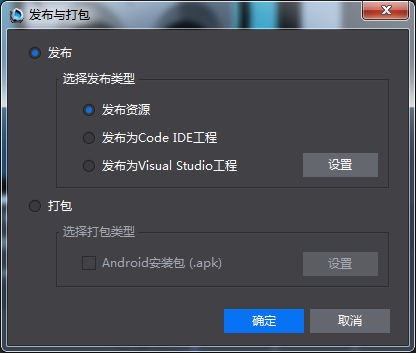
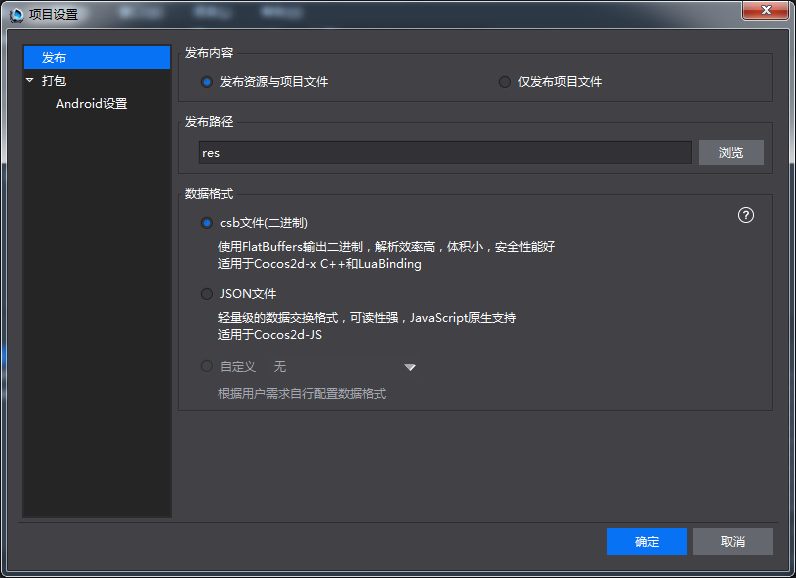

#导出数据

&emsp;&emsp;当使用Cocos Studio编辑好资源后，我们想在引擎里面使用，还需要发布。因为在Cocos Studio项目文件使用xml数据格式来进行存储，同时会保存一些仅编辑器需要的额外数据，如果用户使用Cocos2d-x和Cocos2d-js直接加载项目文件，会发现项目文件不仅大而且加载速度慢，所以我们需要一个发布，在发布过程中编辑器会去掉项目文件中一些多余的信息，同时把xml格式转换为flatbuffers和json格式，这两种格式在C++，lua 和JS语言中使用是容量最小，速度最快，接下来给大家讲解如何发布资源：

&emsp;&emsp;1）打开我们的HelloCocos，选择发布按钮“ ”，点击发布，资源就发布出去了。

&emsp;&emsp;2）点击“发布与打包。。。”，会弹出发布与打包界面，如下图：

&emsp;&emsp;&emsp;&emsp;&emsp;&emsp;&emsp;&emsp;

&emsp;&emsp;3）发布资源：执行发布资源过程。

&emsp;&emsp;&emsp;&emsp;&emsp;发布为Code IDE工程：先执行发布资源过程，然后使用Code IDE打开项目，C++项目此选项为灰。

&emsp;&emsp;&emsp;&emsp;&emsp;发布为Visual Studio工程： 仅Windows上，先执行发布资源过程，然后使用Visual Studio打开项目。

&emsp;&emsp;&emsp;&emsp;&emsp;发布为Xcode工程： 仅Mac上，先执行发布资源过程，然后使用Xcode打开项目。

&emsp;&emsp;4）点击设置，弹出“菜单：项目->项目设置。。。”界面，如下图：

 
&emsp;&emsp;5）发布内容：

&emsp;&emsp;1、发布资源与项目文件：把编辑所用的资源拷贝到发布路径以及把csd，csi文件发布为Cocos2d-x所使用的资源。注意：当资源较多的时候，拷贝速度比较慢，建议使用仅发布项目文件。

&emsp;&emsp;2、仅发布项目文件：仅把csd，csi文件发布为Cocos 2d-x所使用的资源。

&emsp;&emsp;发布路径：可以自定义资源的发布路径，支持绝对与相对路径。
数据格式：

&emsp;&emsp;1、csb： 使用Flatbuffers输出二进制，解析效率高，体积小，安全性能好，适用于c++与lua项目。

&emsp;&emsp;2、 Json：轻量级的数据交换格式，可读性强，JavaScript原生支持，适用于js项目。

&emsp;&emsp;3、 自定义：参考 [导出数据扩展。](../../chapter3/Extend/CustomExport/zh.md)

