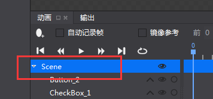

# **回调特性** #

现在可以直接在编辑器里边指定某个控件的事件的处理函数。 
不再需要一个一个去get控件啦。也不再需要因为修改了控件名或者其他属性后，就得去改程序了。 
以下分别提供C++、Lua如何使用callback方法。

C++：

1，在编辑器点击根节点，如下图：

   
  
2，在高级属性->回调特性->自定义类 添加类名，比如 MyClass，如图：

   

3，选中想要设置回调特性的控件，进入高级属性->回调特性->回调方法，选择接受的回调类型以及输入回调方法名称：
如：Touch方法，名称为onTouch： 

   

4，在C++中，创建一个自己的自定义类：

这个类必须遵循如下要求： 

a.继承WidgetCallBackHandlerProtocol和 Node(或其他继承自Node的类) 

b.重写如下接口： 

	  onLocateTouchCallback 
	  onLocateClickCallback 
	  onLocateEventCallback 

返回对Touch、Click、Event三种事件的处理函数。（可以只重写你使用到的回调类型）。 

如： //.h file 

	#ifndef __TestCpp__MyClass__ 
	#define __TestCpp__MyClass__ 
	#include "cocos2d.h" 
	#include "cocostudio/CocoStudio.h" 
	#include "cocostudio/WidgetCallBackHandlerProtocol.h" 
	class MyClass : public cocos2d::Node, public cocostudio::WidgetCallBackHandlerProtocol 
	{ 
	public: 
		CREATE_FUNC(MyClass) 
		MyClass(); 
		virtual cocos2d::ui::Widget::ccWidgetTouchCallback 
		onLocateTouchCallback(const std::string &callBackName); 
		virtual cocos2d::ui::Widget::ccWidgetClickCallback 
		onLocateClickCallback(const std::string &callBackName); 
		virtual cocos2d::ui::Widget::ccWidgetEventCallback 
		onLocateEventCallback(const std::string &callBackName); 
		void onTouch(cocos2d::Ref* sender, cocos2d::ui::Widget::TouchEventType type); 
		void onClick(cocos2d::Ref* sender); 
		void onEvent(cocos2d::Ref* sender, int eventType); 
	 private: 
		std::vector<std::string> _touchTypes; 
		std::string _click; 
		std::vector<std::string> _eventTypes; 
	}; 
	//.cpp file 
	#include "MyClass.h" 
	#include "ui/UIText.h" 
	
	USING_NS_CC; 
	using namespace std; 
	using namespace cocos2d::ui; 
	
	MyClass::MyClass() 
	{} 
	
	Widget::ccWidgetTouchCallback MyClass::onLocateTouchCallback(const string &callBackName) 
	{ 
		if (callBackName == "onTouch")//判断事件名，返回对应的函数。下同 
		{ 
			return CC_CALLBACK_2(MyClass::onTouch, this); 
		} 
		return nullptr; 
	} 
	
	Widget::ccWidgetClickCallback MyClass::onLocateClickCallback(const string &callBackName) 
	{ 
		if (callBackName == "onClick") 
		{ 
			return CC_CALLBACK_1(MyClass::onClick, this); 
		} 
		return nullptr; 
	} 
	
	Widget::ccWidgetEventCallback MyClass::onLocateEventCallback(const string &callBackName) 
	{ 
		if (callBackName == "onEvent") 
		{ 
			return CC_CALLBACK_2(MyClass::onEvent, this); 
		} 
		return nullptr; 
	} 
	
	void MyClass::onTouch(cocos2d::Ref* object, cocos2d::ui::Widget::TouchEventType type) 
	{ 
		CCLOG("onTouch"); 
	} 
	
	void MyClass::onClick(cocos2d::Ref* sender) 
	{ 
		CCLOG("onClick"); 
	} 
	
	void MyClass::onEvent(cocos2d::Ref* sender, int eventType) 
	{ 
		CCLOG("onEvent"); 
	} 

4，为第3步编写的类创建工厂类：

   	 这个类必须继承cocostudio::NodeReader，并重写如下三个接口 
  	 getInstance —— 返回工厂类的单例 
     purge —— 销毁工厂类 
     createNodeWithFlatBuffers —— 创建第3步编写的类，并调用setPropsWithFlatBuffers 
如： 
   
   //.h file 
   
	#ifndef __cocos2d_libs__MyClassReader__
	#define __cocos2d_libs__MyClassReader__

	#include "cocos2d.h"
	#include "cocostudio/CocosStudioExport.h"
	#include "cocostudio/WidgetReader/NodeReader/NodeReader.h"

	class MyClassReader : public cocostudio::NodeReader
	{       
	public:
		MyClassReader() {};
		~MyClassReader() {};   
		static MyClassReader* getInstance();
		static void purge();
		cocos2d::Node* createNodeWithFlatBuffers(const flatbuffers::Table* nodeOptions);
	};

	#endif /*defined(__cocos2d_libs__MyClassReader__) */ 

	//.cpp file
	#include "MyClassReader.h"
	#include "MyClass.h"

	USING_NS_CC;
	
    static MyClassReader* _instanceMyClassReader = nullptr;
	MyClassReader* MyClassReader::getInstance()
	{
		if (!_instanceMyClassReader)
		{
			_instanceMyClassReader = new MyClassReader();
		}
		return _instanceMyClassReader;
	}

	void MyClassReader::purge()
	{
		CC_SAFE_DELETE(_instanceMyClassReader);
	}

	Node* MyClassReader::createNodeWithFlatBuffers(const flatbuffers::Table *nodeOptions)
	{
		MyClass* node = MyClass::create();
		setPropsWithFlatBuffers(node, nodeOptions);
		return node;
	} 

5，在加载节点之前注册这个接口到CSLoader中
  
	CSLoader* instance = CSLoader::getInstance();
	//注意第一个参数必须是第一步填写的自定义类名加“Reader ”如上述的"MyClassReader" 
	instance->registReaderObject("MyClassReader",(ObjectFactory::Instance)MyClassReader::getInstance);

6，使用CreateNode加载你的节点，因为你的自定义类的create已经委托给工厂类，只要你注册工厂类的时候没写错，工厂类会在createNode里边create你的自定义类并调用 onLocateTouchCallback，onLocateClickCallback，onLocateEventCallback实现代码回调与编辑器的绑定。 

Lua：
   参考启动器教程页《Cocos如何绑定Lua自定义类》。
